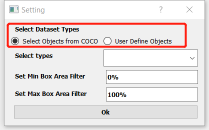
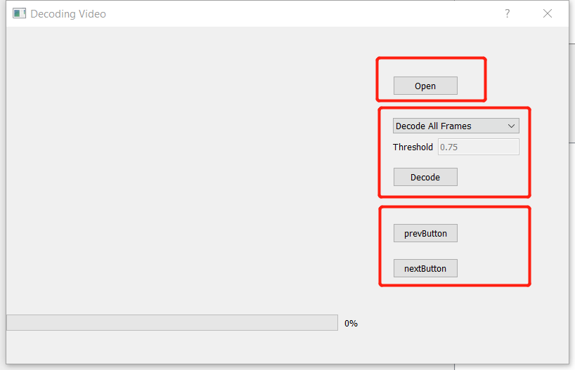
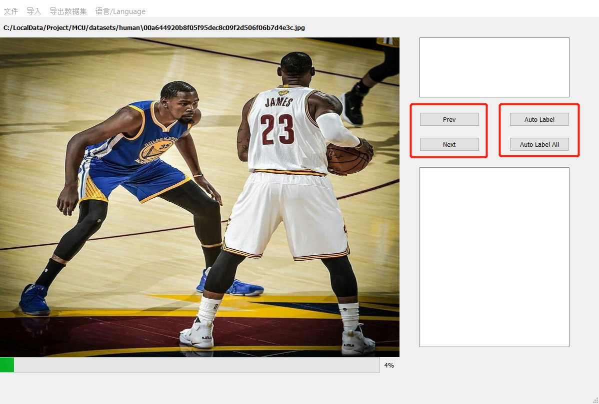
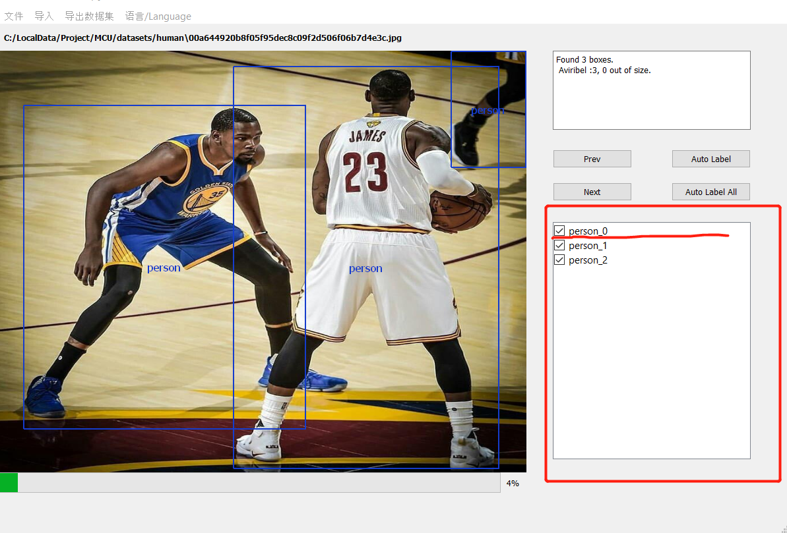

# Auto Label

#### 介绍 / Introduction

Auto Label 工具用于标注制作物体检测(OD)数据集，支持导入jpge、jpg图片或mp4格式视频，自动标注图片的物体或使用鼠标在图片中画框并标注物体类型。其中自动标注功能是通过运行yolo v7模型实现，yolo模型是基于COCO数据集训练。

Auto Label tool is used to label and create object detection (OD) data sets. It supports importing JPGE, JPG pictures or MP4 format videos, automatically marking the objects in the pictures or using the mouse to draw a frame in the pictures and label the object types. The automatic annotation function is realized by Yolo V7 model, which is trained based on coco data set.

## 依赖库 / Requirements

    python 3.7 or higher
    pyqt5
    numpy
    opencv-python
    tarfile
    onnxruntime
    jinja2

## 运行教程 / How to Run

    install python 3.7
    python -m pip install -r requirements.txt
    python mainUI.py

## 使用指南 / User Manaual

### 新建、编辑工程 / New, Edit Project

    '文件'菜单中选择新建工程，选择要保存的工程文件(json格式)。
    新建工程会弹出设置窗口。如下图所示：

    Select new project from the 'file' menu and select the
    project file (JSON format) to save. The setting window will pop up
    when you create a new project. As shown in the following figure:

    选择数据集标签类别: Select Objects from COCO ，Usr Define Objects。
    第一种从COCO数据集80分类中选择支持的目标类别。第二种方式自定义目标类别。
    设置锚框过滤条件：模块面积与图片面积的比。用于过滤无效的过小的锚框。
    打开工程后可以通过文件菜单中的编辑工程重新编辑设置选选项。

    Select the dataset label category: select objects from coco,
    usr define objects. The first is to select a supported target category
    from the coco dataset 80 classification. The second way is to customize
    the target category.
    Set the anchor box filter condition: the ratio of the module area
    to the image area. Used to filter invalid anchor boxes that are too small.
    After opening the project, you can re edit the selected option through
    edit project in the file menu.

### 打开、保存工程 / Open Save Project

    '文件'菜单保存工程可以把当前状态保存至工程文件中。通过打开工程继续标注工作。

    The 'file' menu save project can save the current state to the project file.
    Continue dimensioning by opening the project.

### 导入 / Import

    通过'导入'菜单导入图片文件夹或视频文件。

    Import picture folders or video files through the 'import' menu.

#### 导入静态图片 / Import images

    选择存放jpg格式图片的文件夹。中央的预览界面会显示当前图片，
    可以点击'Next'或'Prev'按钮切换显示图片。

    Select the folder where JPG format pictures are stored.
    The preview interface in the center will display the current picture,
    You can click 'next' or 'prev' button to switch the display picture.

#### 导入视频文件 / Import video file

    选择视频选项，进入视频解码界面，如下图所示：

    Select the video option to enter the video decoding interface,
    as shown in the following figure:

    点击'Open'按钮选择mp4文件。通过下拉菜单选择解码方式：解码所有帧，解码关键帧。其中解码关键帧是基于算法计算连续两帧图像的差值，差值大于阈值则保留帧图像，通过Threshold设置阈值大小(值范围0~1)。
    解码完成后在界面中央显示预览图像，可以通过'Next','Prev'切换图像。关闭窗口后帧图像导入到工程中。

    Click the 'open' button to select the MP4 file. Select the decoding
    method through the drop-down menu: decode all frames and decode key frames.
    The decoding key frame is based on the algorithm to calculate the difference between two consecutive frames of images. If the difference is greater than the threshold,
    the frame image is retained, and the threshold value is set through threshold text input
    (range from 0 to 1.0).
    After decoding, the preview image will be displayed in the center of the interface.
    You can switch the image through 'next' and 'prev'. After closing the window,
    the frame image is imported into the project.

### 标注 / Label

    完成导入数据后显示图片预览。可以使用'Next','Prev'切换图片.
    自定义目标如果不在COCO 80分类中，则需要手动画框标注.
    界面如下图所示：

    Display picture preview after importing data. You can use 'next' and 'prev'
    to switch pictures. If user defined type not support by COCO dataset then
    you should draw the box manually.
    The interface is as shown in the following figure:

#### 自动标注 / Auto Label

    点击'Auto Label'自动识别图片中的目标(设置中选择的支持类别).
    也可以点击'Auto Label All'一次标注所有图片。

    Click 'Auto Label' to automatically identify the target in the picture
    (the support category selected in the setting)
    You can also click 'Auto label all' to mark all pictures at once.
    Note: automatic annotation is not supported for custom target categories

#### 手动标注 / Manually Label

    鼠标移动到图片上方，在目标左上角点击鼠标左键开始画框，移动到右下角抬起左键，
    从弹出菜单中选择目标类别，如果不想保存锚框选择'Cancel'选项。

    Move the mouse over the picture, click the left mouse button in the upper
    left corner of the target to start the picture frame, move to the lower
    right corner and lift the left mouse button,
    Select the target category from the pop-up menu, and select the 'Cancel'
    option if you do not want to save the anchor box.

#### 目标删除 / Delete Object

    右侧列表列出所有目标，点击列表checkBox选择是否保留目标。

    All targets are listed in the list on the right.
    Click the checkbox in the list to select whether to keep the targets.

### 导出数据集 / Export Dataset

    完成所有图片的标注后，在'导出数据集'菜单，选择保存的voc文件导出数据集。

    After all the pictures are annotated, in the export data set menu,
    select the saved VOC file to export the data set.

## EXE程序打包 / How to Package exe

    python -m venv venv
    venv\Scripts\active
    python -m pip install -r requirements.txt
    pip install nuitka

    nuitka --standalone --include-data-dir=./yolo=yolo --include-data-dir=./templates=templates --plugin-enable=pyqt5 mainUI.py --output-dir=packages --enable-plugin=numpy
